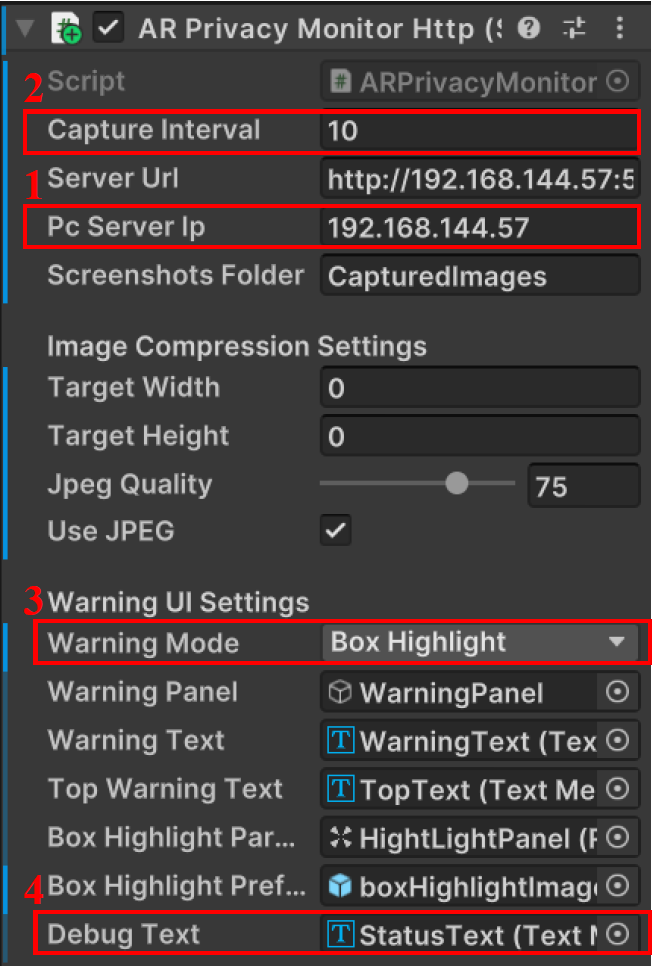
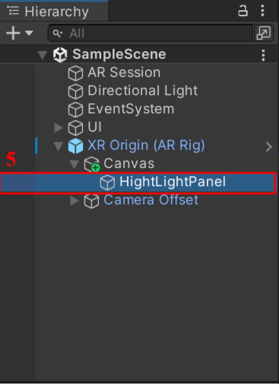
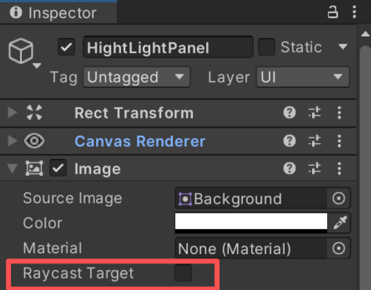

# PrivAR

This repository accompanies the paper **"See no evil: Semantic context-aware privacy risk detection for AR"** to appear at IEEE ICASSP 2026.


* [Installation & Usage](#1)
* [Dataset](#2)

## 🚀 Installation & Usage  <span id="1">

### Prerequisites

1. **Unity Environment**
   
* *Unity Version:* `2022.3.6f1`.
* *Target Platform:* Android / iOS (AR Mobile).
* *Required Unity Packages:* Open `scripts/PrivARMobile` folder in Unity via Unity Hub. Install all of the following via **Window → Package Manager** in Unity: `com.unity.xr.arfoundation`, `com.unity.xr.interaction.toolkit`, `com.unity.xr.management`, `com.unity.inputsystem`.
    *Platform-specific package*: `com.unity.xr.arcore` (Android) or `com.unity.xr.arkit` (iOS).

2. **Python Environment**
   
* *Python Version:* `3.7+`.
* *Dependencies:*
    The following libraries are required: `numpy`, `opencv-python`, `scipy`, `openai`, `requests`, `flask`, `pytesseract`, `subprocess`.
3. **Network Setup**
   
   The mobile device and the edge server (e.g., a computer) must be connected to the *same Wi-Fi network*.

4. **OpenAI API Key Setup**
   
   Set up your OpenAI API Key in the environment variable (for VLM inference).

### PrivAR Dataset Collection App
#### Step 1: Configure Parameters in Unity
Open the `ARPrivacyMonitorHttp.cs` script on the **XR Origin (AR Rig)** GameObject and set:

<p>
  
  
  
</p>

1. **IP Address** — set `Pc Server Ip` to the IP address of your Wi-Fi network.
2. **Trigger interval** — configure between 20s and 30s.
3. **Warning mode** — choose one of three modes: `Center Panel` / `Top Text` / `Box Highlight`.
4. **Debug option** — check `StatusText` to show step outputs on the device during testing; uncheck for formal experiments.
5. **Raycast Target** — uncheck the `Raycast Target` box on the `HightLightPanel` component to allow AR privacy detection and object placement to run simultaneously.

#### Step 2: Build the AR App
1. Connect your phone via USB cable.
2. Enable Developer Mode and USB Debugging on the phone.
3. In Unity, go to **File → Build Settings → Run Device**, select your connected device (minimum Android version: 29).
4. Click Build And Run.

#### Step 3: Start the Edge Server
1. Open `PrivARMobile/Assets/MobileARTemplateAssets/Scripts/privacy_http_server.py`.
2. Set the variable `EAST_model_path` to point to `model/frozen_east_text_detection.pb`.
3. Navigate to `<project_root>`, then run `python scripts/privacy_http_server.py`.

#### Step 4: Run the App
1. Launch the AR app on the mobile device.
2. The app will capture an image at each set interval, upload it to the edge server, and return warning feedback.

### PrivAR Evaluation
Navigate to `<project_root>`, then run python `scripts/PrivAR_pipeline.py` and `scripts/character_leakage_rate.py`. `PMPrivAR_pipeline.py` runs the full PrivAR pipeline on a dataset and outputs per-subset Excel files with accuracy metrics. `character_leakage_rate.py` measures how much private text survives obfuscation using OCR or GPT-4o, outputting leakage scores.

## 📂 Dataset <span id="2">
The dataset can be downloaded [**here**](Datasets/).

* Scenes: The data covers 4 diverse indoor environments: office, living room, bedroom, and café

* Virtual objects used in AR interactions: 01 coffee cup, 02 whiteboard, 03 indoor plant, 04 guitar, 05 vase, and 06 chair

* Sensitive information: 01 ID cards, 02 credit cards, 03 password notes, 04 medical records, 05 text displayed on computer screens, 06 text displayed on phone screens.
  
* Hard negatives: To evaluate robustness, the dataset includes **visually similar but non-sensitive negative samples**, such as published academic papers and coupons, which share visual characteristics with sensitive documents.


## 🔗 Citation
The author of this repository is Jialu Liu. For questions, please contact: liujialu2001@gmail.com.

If you find this work useful in your research, please cite our paper:
```bibtex
@inproceedings{PrivAR,
  title={See No Evil: Semantic Context-Aware Privacy Risk Detection for AR},
  author={Liu, Jialu and Li, Yao and Li, Zhuoheng and Ying, Chen},
  booktitle={Proceedings of IEEE ICASSP},
  year={2026}
}
```
